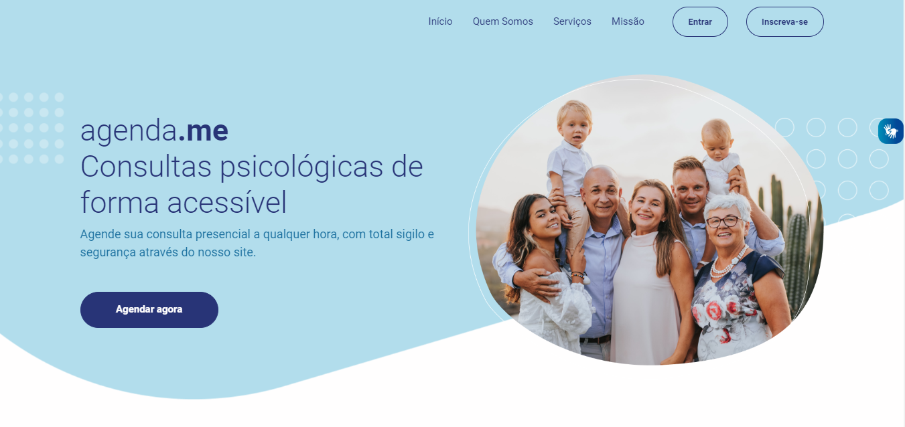
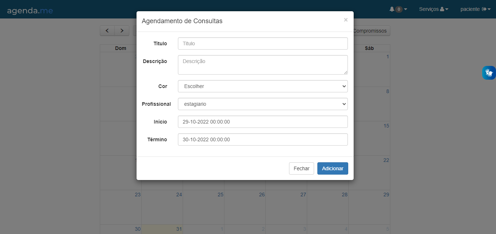
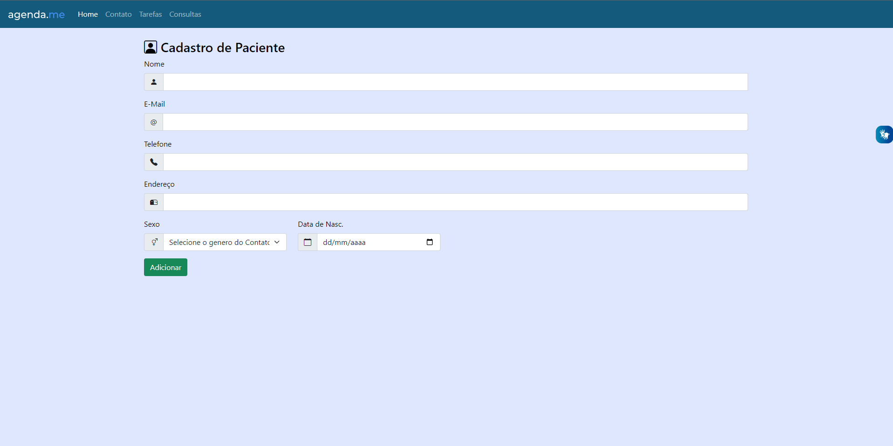

# crud-de-cadastro-php-fullcalendar-mysql
Cadastro de Eventos com suporte a usuários e cadastro de pacientes com CRUD. (PHP, MySQL, JS, Bootstrap, FullCalendar).

<p align="center">

</p>

Calendário WEB onde pode-se criar eventos e conta com uma edição customizada de arrastar e soltar através do FullCalendar ligado com a implementação do CRUD ao banco MySQL.

## Funções implementadas
- Login para acesso ao sistema;
- Adição de eventos;
- Edição de eventos;
- Remoção de eventos;
- Listagem de eventos;
- Descrição  de eventos;
- Hora de início do evento;
- Hora de Termino do evento;
- Consulta outros usuários para atendimento, ou seja, a consulta aparecerá no calendário do usuário solicitado e o usuário (Estagiário) poderá responder se poderá aceitar ou não;
- Cadastro de paciente;
- Edição de paciente;
- Remoção de paciente;
- Listagem de paciente;
- Cadastro de tarefa;
- Edição de tarefa;
- Remoção de tarefa;
- Listagem de tarefa;
- Descrição  de tarefa;
- Hora de início da tarefa;
- Hora de Termino da tarefa;
- Responsividade;


## Instalando

Antes de qualquer coisa você precisa ter um ambiente PHP/Apache/Mysql configurado em sua maquina, pois o mesmo necessita de um servidor local para funcionar, eu uso XAMPP.

Vá na pasta do seu servidor (Usei o XAMPP 8.1.10) no meu caso a pasta 'htdocs' e execute o comando git clone no 'cmd', caso tenha o git instalado, ou se preferir baixe os arquivos e mova até a mesma.

```
git clone https://github.com/WillianNicomedes/agenda.me.git
```

Agora vá até seu banco de dados no meu caso localhost/phpmyadmin, crie um banco com o nome dbagendame e importe o arquivo dbagendame.sql que se encontra na pasta 'mysql', que contém o Banco de dados e itens pré cadastrados como os Usuários e Tabelas, recomendo abrir o arquivo e verificar os dados. Como as senhas estão em Sha1 deixarei a baixo sem a criptografia:

```
Usuário: estagiario
Senha: 1031

Usuário: paciente
Senha: 1643
```
Pronto basta abrir o diretório onde se encontra os arquivos através do seu servidor, se for local: localhost/NomedaPasta.